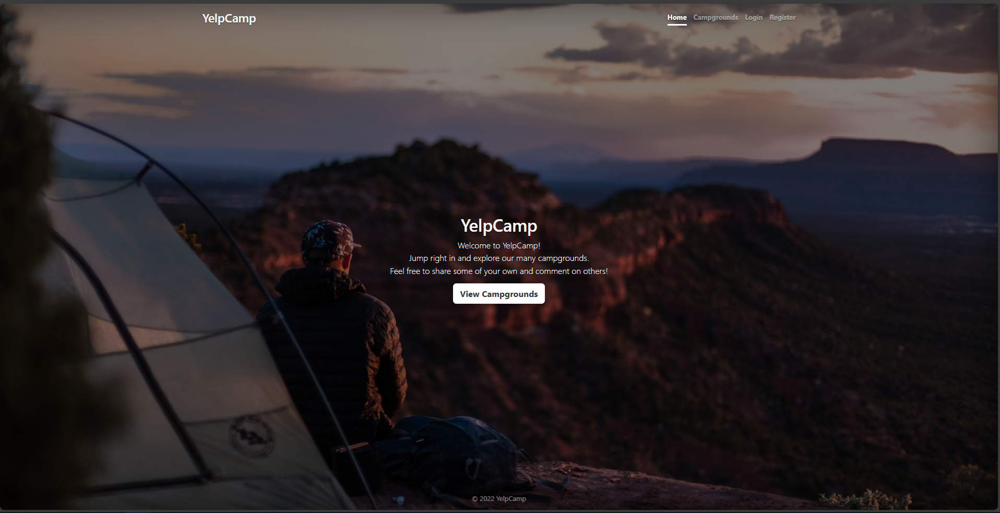
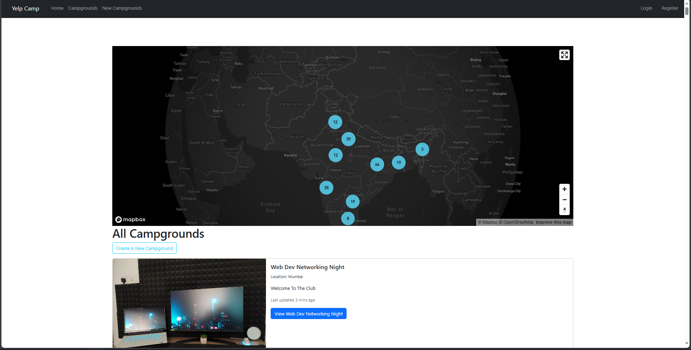
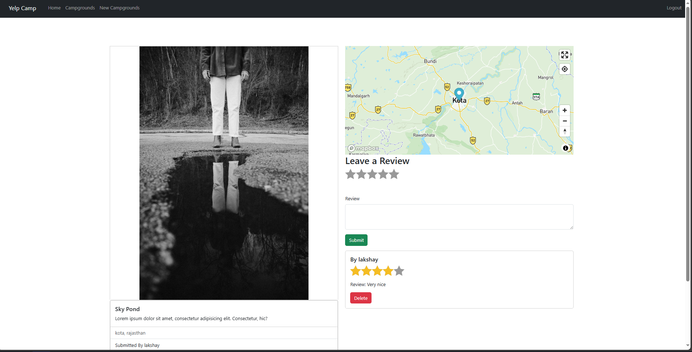
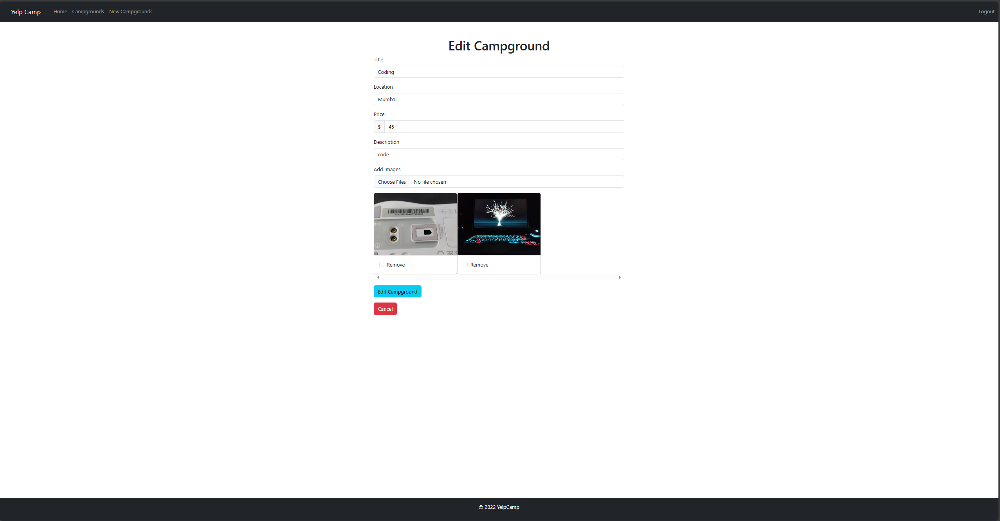
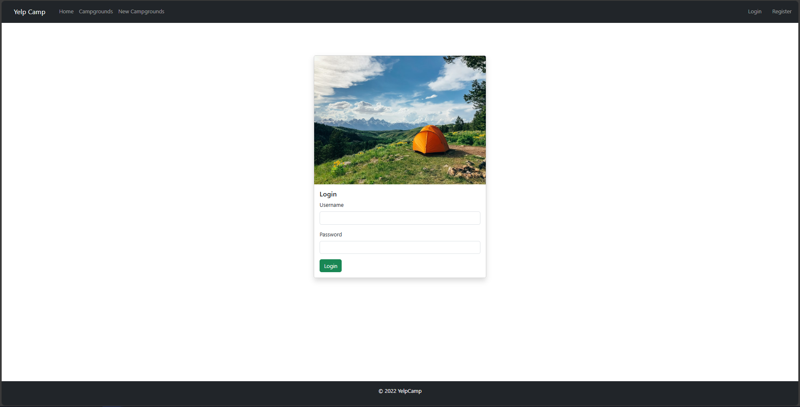

# Getting Started

## Setup

### 1 - Install dependencies

### 2 - Start the backend server

```bash
node ./backend/backend.js
```

### 3 - Start the frontend server

```bash
npm start
```

Note: The backend server will always be running on port 3000, so first make sure that backend server is running and then
start the frontend server. or hardcode the port in scripts in package.json.

```bash
"start": "SET PORT=3001 && react-scripts start",
```

### 4 - Open the app

Open [http://localhost:3001](http://localhost:3001) to view it in the browser.

### 5 - Login

`username: lakshay` `password: 123` or you can create a new account just by clicking on signup button.

## 6 - env file

Create a .env file in the root directory of the project and add the following variables.

```
REACT_APP_MAPBOX_ACCESS_TOKEN=your_tokem
REACT_APP_SECRET=your_secret
REACT_APP_CLOUD_NAME=your_cloud_name_for_cloudinary
REACT_APP_API_KEY=your_api_key_for_cloudinary
REACT_APP_API_SECRET=your_api_secret_for_cloudinary
MONGODB_URI=your_mongodb_uri
```

## Features

- [x] User can view the list of all the camps.
- [x] User can view the details of a camps.
- [x] User can add a new camp.
- [x] User can edit the details of a camp.
- [x] User can delete a camp.
- [x] User can view the list of all the reviews of a camp.
- [x] User can add a new review to a camp.
- [x] User can delete a review.

## Tech Stack

- React
- Redux
- Node.js
- Express.js
- MongoDB
- Mongoose
- Passport.js
- Bootstrap

## Screenshots

### Landing Page



### Home Page


### Campground Page
 

### Add New Campground Page


### Edit Post Page


### Login/Register Page
